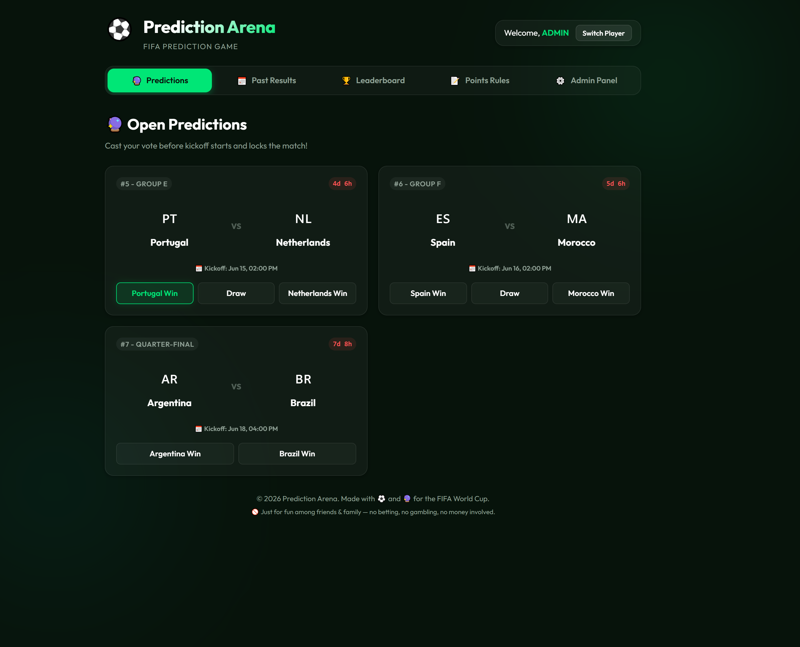
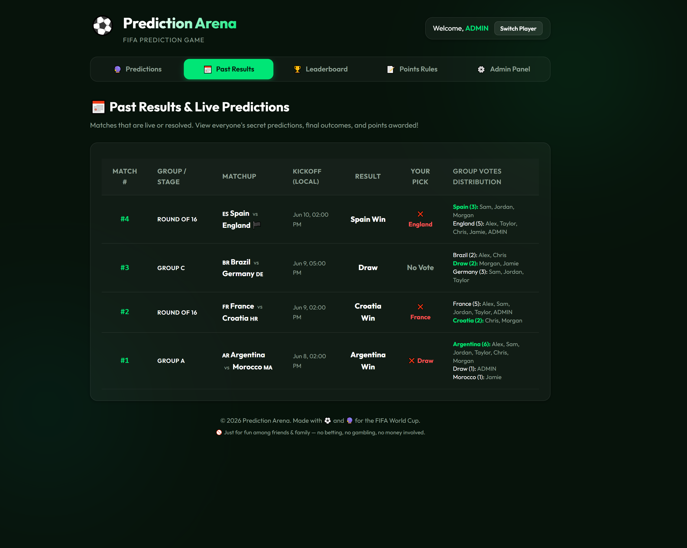
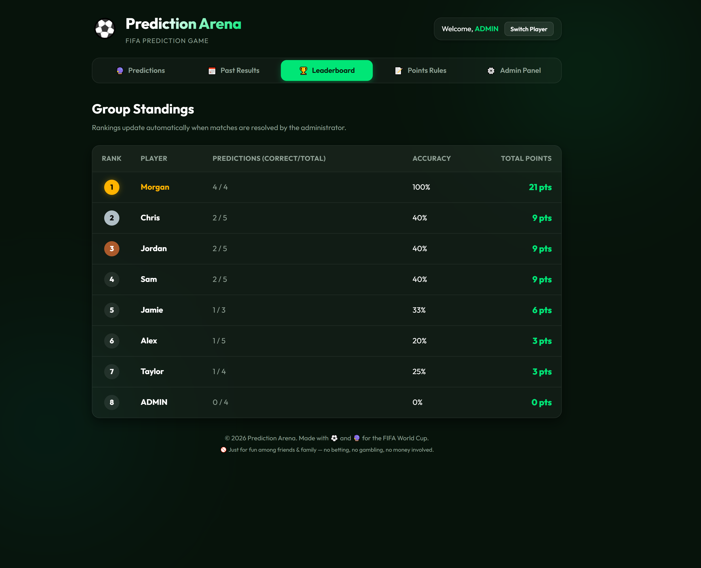
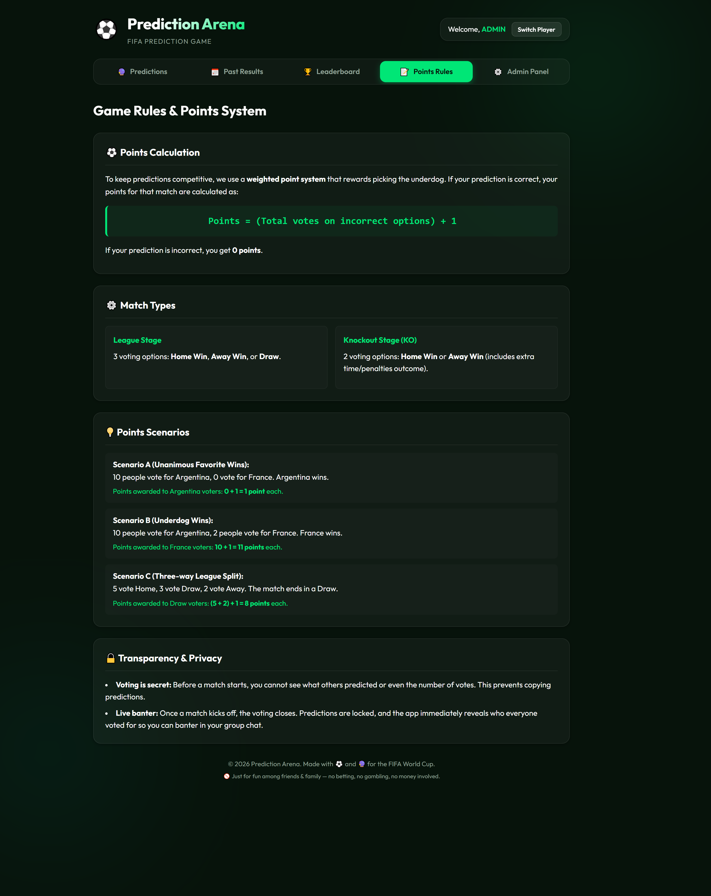
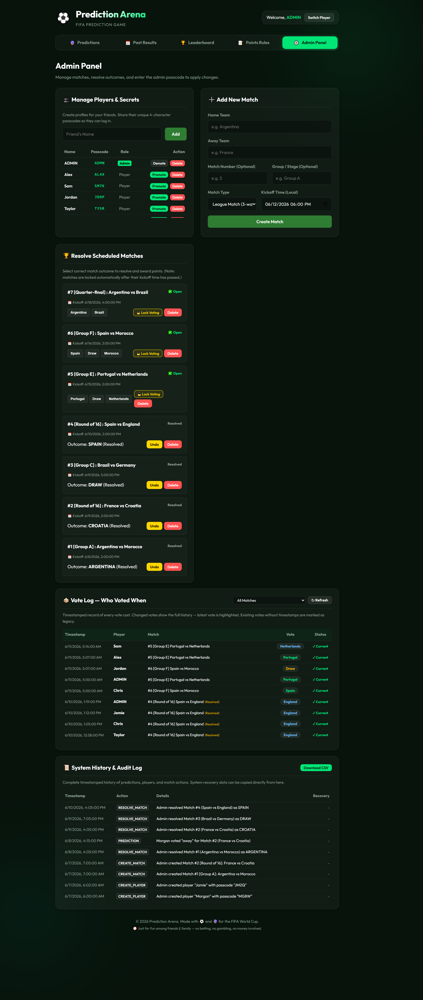
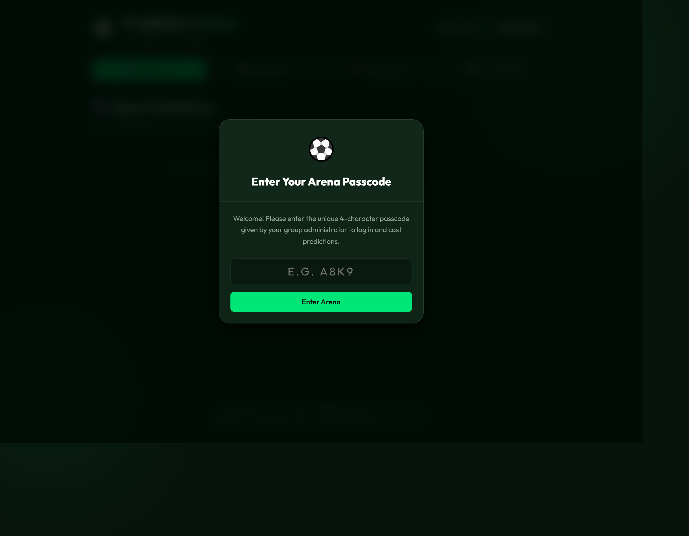

# ⚽ Prediction Arena

A lightweight, self-hostable **football match prediction game** for friend groups —
built for the FIFA World Cup but works for any tournament. Players log in with a short
passcode, predict match outcomes before kickoff, and earn points using an
**underdog-weighted scoring system**. An admin panel lets you manage players, create
matches, resolve results, and audit every vote.

Built with **Node.js + Express** and a plain HTML/CSS/JS frontend (no build step).
Data is stored in a single JSON file, optionally backed by **Google Cloud Storage**
for persistence on Cloud Run.

> ### 🚫 For fun only — not for betting or gambling
> Prediction Arena is a **friendly prediction game for friends and family**. It involves
> **no money, no wagering, no odds, and no prizes** — just bragging rights and banter.
> It is **not** a betting or gambling product and must not be used for any form of
> real-money betting, staking, or gambling. Please play responsibly and keep it fun. 💚

---

## ✨ Features

- 🔮 **Secret predictions** — votes are hidden until kickoff, then revealed so everyone can banter.
- 🏆 **Underdog-weighted scoring** — picking the unpopular winner is worth more points.
- 📅 **League & Knockout matches** — 3-way (Home/Draw/Away) or 2-way (Home/Away) voting.
- 🔒 **Auto-locking** — voting closes automatically at kickoff; admins can lock/unlock or extend.
- 📊 **Live leaderboard** — standings recalculate the moment a match is resolved.
- ⚙️ **Admin panel** — manage players & passcodes, add/resolve matches, view a full audit log.
- ☁️ **One-command deploy** to Google Cloud Run (scales to zero — effectively free for small groups).

---

## 📸 Screenshots

> **Note for the repo owner:** drop your own screenshots into `docs/images/` using the
> filenames below and they'll render here. See [`docs/images/README.md`](docs/images/README.md)
> for the shot list.

| Predictions | Past Results & Live Votes |
| --- | --- |
|  |  |

| Leaderboard | Points Rules |
| --- | --- |
|  |  |

| Admin Panel | Login |
| --- | --- |
|  |  |

---

## 🕹️ The tabs at a glance

| Tab | What it does |
| --- | --- |
| **🔮 Predictions** | Shows matches open for voting (before kickoff, or while an admin extension is active). Pick Home / Draw / Away. You can change your vote any time before it locks. |
| **📅 Past Results** | Matches that are live or resolved. Reveals everyone's picks, the final outcome, and points awarded. |
| **🏆 Leaderboard** | Auto-ranked standings: points, correct/total predictions, and accuracy. |
| **📝 Points Rules** | In-app explanation of the scoring formula and worked examples. |
| **⚙️ Admin Panel** | Only visible to admins. Manage everything (see the [Admin guide](#-admin-guide)). |

### Scoring

If your prediction is correct:

```
Points = (total votes on the incorrect options) + 1
```

If it's wrong, you get **0**. This rewards picking against the crowd:

- Everyone (10 people) picks Argentina, Argentina wins → each gets `0 + 1 = 1` point.
- 10 pick Argentina, 2 pick France, **France wins** → the 2 France voters get `10 + 1 = 11` points each.
- League match, 5 Home / 3 Draw / 2 Away, ends in a **Draw** → Draw voters get `(5 + 2) + 1 = 8` each.

---

## 🚀 Quick start (local)

**Requirements:** Node.js 18+ (20+ recommended).

```bash
# 1. Install dependencies
npm install

# 2. Start the server
npm start          # or: npm run dev   (auto-restarts on file changes)

# 3. Open the app
#    http://localhost:3000
```

On first run the server creates a local `data.json` seeded with a single default
admin account (see [Default credentials](#-default-credentials)).

---

## ⚙️ Configuration

All configuration is via environment variables (copy `.env.example` → `.env` for local dev):

| Variable | Default | Description |
| --- | --- | --- |
| `PORT` | `3000` | Port the server listens on. |
| `GCS_BUCKET_NAME` | _(empty)_ | If set, data is read/written to this Google Cloud Storage bucket instead of the local `data.json`. Used in production on Cloud Run. |
| `ADMIN_PASSCODE` | _(uses `data.json`)_ | Admin-panel passcode. When set, it **overrides** the `adminPasscode` stored in `data.json`. Recommended for production. |
| `DEFAULT_ADMIN_NAME` | `ADMIN` | Name of the default admin account seeded on a fresh database. |
| `DEFAULT_ADMIN_SECRET` | `ADMN` | Login passcode for the default admin account on a fresh database. |

---

## 🔑 Default credentials

A fresh install ships with placeholder credentials — **change them before going live:**

| What | Default | Where to change |
| --- | --- | --- |
| Default admin **login passcode** | `ADMN` | Log in, open the Admin Panel → add yourself as a player and delete/rename the default, or set `DEFAULT_ADMIN_SECRET`. |
| **Admin-panel passcode** | `CHANGE_ME` | Set the `ADMIN_PASSCODE` env var (preferred), or edit `adminPasscode` in `data.json`. |

There are **two** passcodes by design:
1. A **login passcode** identifies each player (4 characters, auto-generated when an admin adds them).
2. The **admin-panel passcode** is a second gate to unlock the admin controls.

---

## ☁️ Deploy to Google Cloud Run

The app runs great on **Google Cloud Run**: it scales to zero when idle (so it's
basically free for a small group) and persists data to a Cloud Storage bucket so
nothing is lost on restart or redeploy.

### Step 0 — One-time setup

1. **Install the Google Cloud CLI** (`gcloud`): https://cloud.google.com/sdk/docs/install
2. **Create a Google Cloud project** with **billing enabled** (Cloud Run's free tier covers small apps). Note its **Project ID** — e.g. `my-fifa-app-123`.
3. **Log in** from your terminal:
   ```bash
   gcloud auth login
   ```

Throughout the steps below, replace these placeholders with your own values:

| Placeholder | Meaning | Example |
| --- | --- | --- |
| `YOUR_PROJECT_ID` | Your Google Cloud project ID | `my-fifa-app-123` |
| `YOUR_ADMIN_PASSCODE` | The admin-panel passcode you choose | `a-strong-secret` |

---

### Option A — One command (Windows / PowerShell) ✅ easiest

From the project folder, run the included script with your project ID and a strong admin passcode:

```powershell
.\deploy.ps1 -ProjectID YOUR_PROJECT_ID -AdminPasscode "YOUR_ADMIN_PASSCODE"
```

That's it. The script does everything: sets the project → enables the required APIs →
creates the storage bucket (if missing) → seeds the initial data **only on the first
deploy** → builds the container → deploys to Cloud Run. When it finishes it prints your
public URL (like `https://fifa-predictions-xxxxx.run.app`). 🎉

---

### Option B — Manual steps (works on macOS / Linux / Windows)

Run these one at a time. Replace the placeholders as you go.

```bash
# 1. Select your project
gcloud config set project YOUR_PROJECT_ID

# 2. Enable the APIs (Run = hosting, Storage = data, Build = container builds)
gcloud services enable run.googleapis.com storage.googleapis.com cloudbuild.googleapis.com

# 3. Create a storage bucket for the data (name must be globally unique)
gcloud storage buckets create gs://YOUR_PROJECT_ID-fifa-data --location=us-central1

# 4. Seed the initial data file — FIRST DEPLOY ONLY (skip if the bucket already has data)
gcloud storage cp data.example.json gs://YOUR_PROJECT_ID-fifa-data/data.json

# 5. Build the container image
gcloud builds submit --tag gcr.io/YOUR_PROJECT_ID/fifa-predictions

# 6. Deploy to Cloud Run
gcloud run deploy fifa-predictions \
  --image gcr.io/YOUR_PROJECT_ID/fifa-predictions \
  --region us-central1 \
  --platform managed \
  --allow-unauthenticated \
  --max-instances 1 \
  --set-env-vars GCS_BUCKET_NAME=YOUR_PROJECT_ID-fifa-data,ADMIN_PASSCODE=YOUR_ADMIN_PASSCODE
```

> The `\` at the end of each line continues the command on the next line. That works in
> **bash** (macOS/Linux). In **PowerShell** use a backtick `` ` `` instead; in **Windows
> CMD** use a caret `^`.

When it finishes, Cloud Run prints a public URL anyone can open.

---

### Updating later

To ship a code change, just **re-run the same deploy** (Option A or steps 5–6 of Option B).
It rebuilds and redeploys **without touching your live data** — step 4 is skipped because
the bucket already has a `data.json`.

> ⚠️ **Data safety:** once players start voting, the **live source of truth is the
> bucket**, not your local `data.json`. Never re-upload `data.json` to a live bucket
> (it would overwrite real votes). `--max-instances 1` keeps a single server copy so
> concurrent writes can't clobber each other. Manage players/matches through the admin UI.

For more detail, see **[DEPLOY_GUIDE.md](DEPLOY_GUIDE.md)**.

---

## 🛠️ Admin guide

Admins see an extra **⚙️ Admin Panel** tab. Enter the admin passcode once to unlock it.

- **👥 Manage Players & Secrets** — add a player (a unique 4-char passcode is generated to share with them), promote/demote admins, or delete players. Deleted players can't log in, but their past votes still display.
- **➕ Add New Match** — set home/away teams, match number, group/stage, type (League = 3-way, Knockout = 2-way), and kickoff time.
- **🏆 Resolve Matches** — pick the actual outcome to award points instantly. **Undo** re-opens a resolved match. **Lock/Unlock** manually controls voting. **Reopen/Extend** re-opens voting for 1–120 minutes after kickoff.
- **🗳️ Vote Log** — timestamped record of every vote, including changed votes (latest is highlighted).
- **📜 System History & Audit Log** — every admin action and prediction, with downloadable CSV and recoverable JSON for deleted items.

Voting locks automatically once a match's kickoff time passes (unless an admin extends it).

---

## 📁 Project structure

```
.
├── server.js          # Express server + API + scoring engine
├── public/
│   ├── index.html     # Single-page UI (tabs, modals)
│   ├── app.js         # Frontend logic (fetch API, rendering)
│   └── style.css      # Styles
├── data.example.json  # Clean seed template (committed)
├── data.json          # Runtime data (git-ignored; auto-created)
├── deploy.ps1         # One-command Cloud Run deploy
├── Dockerfile         # Container image for Cloud Run
├── DEPLOY_GUIDE.md    # Manual deployment walkthrough
└── verify_points.js   # Standalone test for the scoring logic
```

Run the scoring tests with:

```bash
node verify_points.js
```

---

## 📄 License

Released under the **MIT License** — see [LICENSE](LICENSE). Use it, fork it, host your own arena. ⚽
